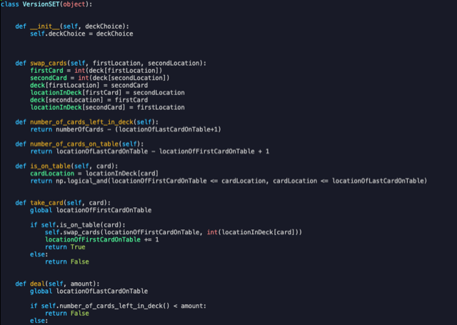

### Climate Changes and Loon Migration 

Over the past 30 years, data, and specifically citizen science data, has become readily available in large quantities. To investigate if Loons have changed wintering behaviors due to climate change in these past decades, this project makes use of the eBird platform run by Cornell University to analyze trends and compute measures of dispersion in an attempt to uncover shifts in wintering ranges over time. I have also incorporated geospatial data from NOAA, the GSHHG database, to better analyze longitude and latitude. This is an ongoing project, but to date the data show a northernly increase in the highest portions of loons wintering range, while the median/mean remains relatively unchanged. 


<a href="{{ site.baseurl }}/img/density_ne_land.png" class="lightgallery-link" data-sub-html="image_description">

</a>

[View code](https://github.com/ThomasMatthews314/eBird_Loons)

[](#)
[](#)
[](#) 

### SET

A seemingly simple pattern-matching card game, SET in fact operates on a deep base of interesting and relevant mathematics, including combinatorics, linear algebra, affine geometries, and more. To uncover some of this behavior, a computation approach was taken to reveal the effects of various initial conditions, experiment with strategies, and discover rare scenarios over tens of millions of game iterations. Due to its versatility, this was done with an object oriented Python program making use of various libraries and techniques to produce, manipulate and analyze the large multidimensional arrays of data. 



```python
class VersionSET(object): 
    def __init__(self, deckChoice):
        self.deckChoice = deckChoice
        
    def swap_cards(self, firstLocation, secondLocation):
        firstCard = int(deck[firstLocation])
        secondCard = int(deck[secondLocation])
        deck[firstLocation] = secondCard
        locationInDeck[firstCard] = secondLocation
        deck[secondLocation] = firstCard
        locationInDeck[secondCard] = firstLocation

    def number_of_cards_left_in_deck(self):
        return numberOfCards - (locationOfLastCardOnTable+1)

    def number_of_cards_on_table(self):
        return locationOfLastCardOnTable - locationOfFirstCardOnTable + 1

    def is_on_table(self, card):
        cardLocation = locationInDeck[card]
        return np.logical_and(locationOfFirstCardOnTable <= cardLocation, cardLocation <= locationOfLastCardOnTable)
        
    def take_card(self, card):
        global locationOfFirstCardOnTable
 
        if self.is_on_table(card):
            self.swap_cards(locationOfFirstCardOnTable, int(locationInDeck[card]))
            locationOfFirstCardOnTable += 1
            return True
        else:
            return False
            
    def deal(self, amount):
```

[View code](https://github.com/ThomasMatthews314/SET)

[](#) 
[](#) 
[](#) 

### Seattle Public Library (SPL)

This project involved a sample of public data from the Seattle Public Library system containing checkouts from 2019 to 2022. With two other team members, we decided to analyze this data from the point of view of identifying topical trends before and after covid, e.g. an increase in bread making books, and presenting that information to hypothetical publishers. Due to the size & messiness of the data, pre-processing was done in R and several different CSV files containing subsetted data were produced alongside statical tests and visuals. These CSV’s were then imported into Tableau to create a series of dashboards to accompany the R code and act as visuals to the presentation. 


<a href="{{ site.baseurl }}/img/spl_dashboard.png" class="lightgallery-link" data-sub-html="image_description">

</a>

[View code](https://github.com/ThomasMatthews314/Coursework)

[](#)
[](#)
[](#)
[](#)


